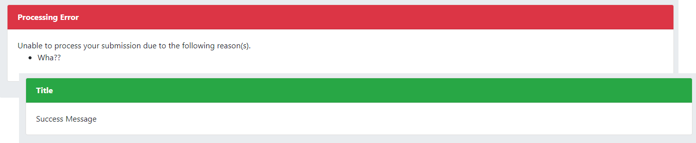
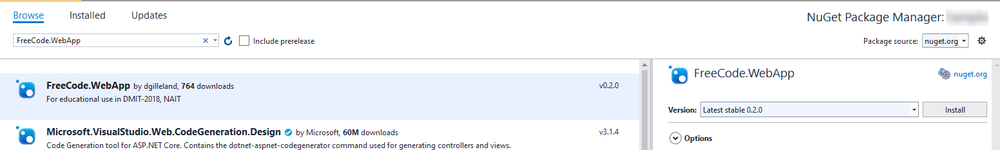
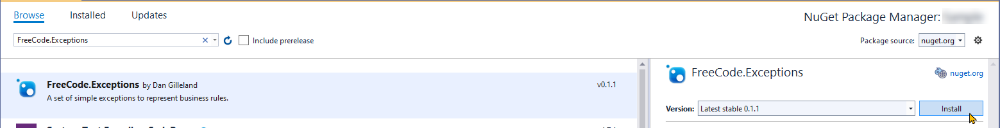
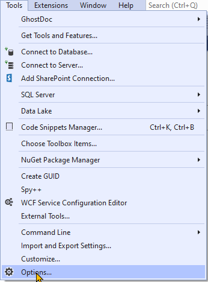
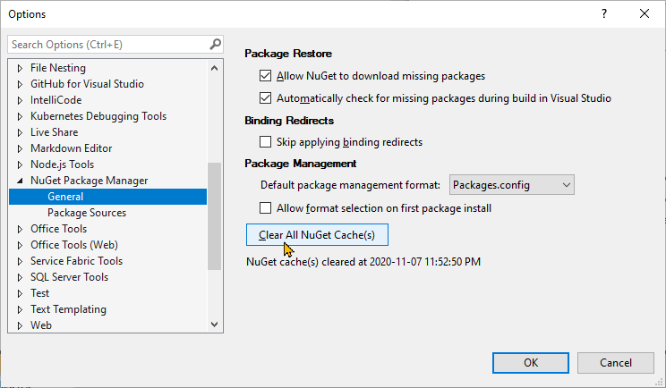

# Message User Control (v 0.2.1.0)

> This is a final release project. Plans exist to sunset this sometime in 2021. This is for educational purposes only - **Do not use in production environments!**.

This version now includes support for [**Business Rule Exceptions**](https://github.com/dgilleland/BusinessRuleException) and **Bootstrap 4**.



## Installing

In your **Web Application Project** (.Net Framework), add the NuGet package for the `FreeCode.WebApp` package.



In your **Class Library Project** (.Net Framework) where your BLL classes are, add the NuGet package for the `FreeCode.Exceptions` package.



### Troubleshooting

If you get errors in attempting to add the packages, it may be because your NuGet cache is not up to date. To clear the cache, go to `Tools > Options..` in Visual Studio and clear the NuGet cache.





----

## Using `BusinessRuleException<T>` and `BusinessRuleCollectionException` in your BLL

These classes are provided for you to use in your back-end controller classes. The following is an example of applying these to your business rule needs.

```csharp
public void SaveFriendsList(int accountId, List<NameInfo> friends)
{
    // 0. Initialize your list of potential business rule errors.
    var errors = new List<Exception>();

    // 1. Validation
    using(var context = new FacePlantContext())
    {
        // 1.A - The user account should exist
        var userAccount = context.Accounts.Find(accountId);
        if (userAccount == null)
            errors.Add(new BusinessRuleException<int>("Account does not exist.", nameof(accountId), accountId));
        // 1.B - The friends list must not be empty
        if (friends == null || friends.Count == 0)
            errors.Add(new BusinessRuleException<List<NameInfo>>("No friends were in the list you supplied.", nameof(friends), friends));

        // 2. Process list
        foreach(var person in friends)
        {
            // 1.C - NameInfo information must be supplied
            if (person == null)
                errors.Add(new BusinessRuleException<NameInfo>("No person details provided.", nameof(person), person));
            else if (string.IsNullOrEmpty(person.FirstName) || string.IsNullOrEmpty(person.LastName))
                errors.Add(new BusinessRuleException<NameInfo>("Incomplete person details.", nameof(person), person));
            else // 2.A - Add the person to the friends list
                userAccount.Friends.Add(new Person { FirstName = person.FirstName, LastName = person.LastName });
        }

        // 1.D - Check the list of errors
        if (errors.Any())
            throw new BusinessRuleCollectionException("Unable to save friends list.", errors);

        // 2.B - Record the latest increase
        userAccount.RecentlyAdded += friends.Count;

        // 3. Handle as a single transaction
        context.SaveChanges(); // should only occur once!!
    }
}
```
